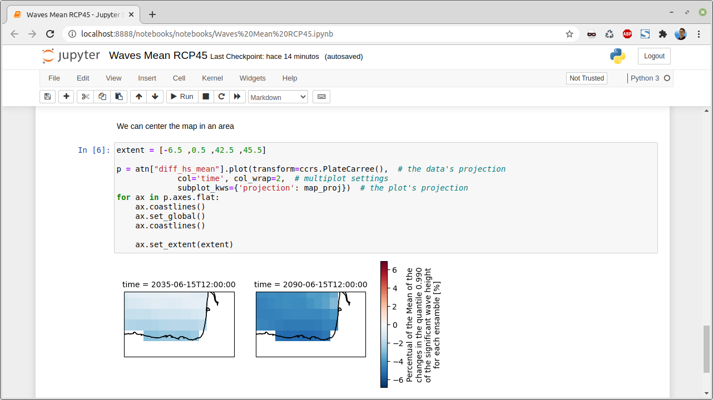

<!-- logo -->
<p align="center"></p>
<h2 align="center">datahub.client.ECLISEA</h3>


<!-- table of contents -->
<details open="open">
  <summary>Table of Contents</summary>
  <ol>
    <li>
      <a href="#about-the-project">About The Project</a>
      <ul>
        <li><a href="#built-with">Built With</a></li>
      </ul>
    </li>
    <li>
      <a href="#getting-started">Getting Started</a>
      <ul>
        <li><a href="#prerequisites">Prerequisites</a></li>
        <li><a href="#installation">Installation</a></li>
      </ul>
    </li>
    <li><a href="#usage">Usage</a></li>
    <li><a href="#contact">Contact</a></li>
  </ol>
</details>

# About The Project


This project contains notebooks with different usage examples for ECLISEA data.

The researcher will be able, with the help of the notebooks, to generate a code to work with the data in a simple way.


# Getting started
The examples of this project can be shown directly through the repository website.

If you want to edit or work with them, then we explain how to use it on your local computer.
## Prerequisites
- Any OS with python
- [Python](https://www.python.org/) 3.6 or newer
- [Pip](https://pypi.org/project/pip/)
- [virtualenv](https://pypi.org/project/virtualenv/) or [conda](https://docs.conda.io/en/latest/) are optional
## Installation


```sh
pip install jupyter
pip install cartopy
pip install git+https://github.com/IHCantabria/datahub.client.git@v0.8.3
```
# Usage
To start Jupyter, which will open a tab in the browser with its interface:

```sh
jupyter notebook
```

Documentation about Jupyter notebook is available in [jupyter-notebook.readthedocs.io](https://jupyter-notebook.readthedocs.io/en/stable/).


# Contact

- Project link: [GitHub datahub.client.ECLISEA](https://github.com/IHCantabria/datahub.client.ECLISEA)
- Issues: [GitHub Issues](https://github.com/IHCantabria/datahub.client.ECLISEA/issues)
- Email: felipe.maza@unican.es

